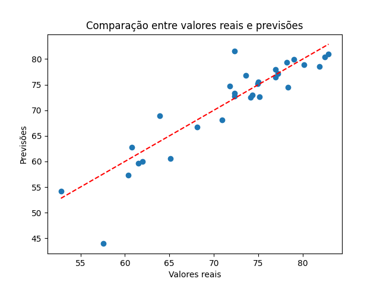

# Relatório de Análise: Impacto dos Indicadores Socioeconômicos na Expectativa de Vida

### 1. Entendimento do Negócio
- **Objetivo:** Avaliar o impacto de fatores socioeconômicos na expectativa de vida dos países, identificando quais variáveis têm uma correlação significativa com a expectativa de vida.

- **Questão de Pesquisa:** Fatores como densidade populacional, taxa de natalidade, gastos com saúde, e taxa de desemprego influenciam a expectativa de vida?

- **Benefícios Esperados:** Este estudo pode ajudar a direcionar políticas públicas, focando em indicadores que, ao serem melhorados, podem aumentar a expectativa de vida.

### 2. Entendimento dos Dados

**- Descrição das Variáveis:**

  - Density(P/Km2): Densidade Populacional
  - Birth Rate: Taxa de Nascimento
  - Fertility Rate: Taxa de Fertilidade
  - Infant mortality: Mortalidade Infantil
  - Life expectancy: Expectativa de Vida (variável alvo)
  - Physicians per thousand: Médicos por mil habitantes
  - Co2-Emissions: Emissões de CO2
  - CPI: Índice de Preços ao Consumidor
  - CPI Change (%): Variação do CPI em porcentagem
  - Out of pocket health expenditure: Despesa com saúde paga diretamente pelo consumidor
  - Population: Labor force participation (%): Taxa de Participação na Força de Trabalho
  - GDP: Produto Interno Bruto
  - Unemployment rate: Taxa de Desemprego

- **Análise Inicial:** Analisar a distribuição dos dados e possíveis correlações iniciais entre as variáveis preditoras e a variável alvo (Life expectancy).

### 3. Preparação dos Dados

- **Limpeza de Dados:** Verificar e tratar valores nulos ou inconsistentes.
- **Transformações:** Escalonar variáveis quantitativas e verificar necessidade de transformação logarítmica para variáveis como GDP ou Density(P/Km2).
- **Análise de Outliers:** Identificar e tratar outliers que podem distorcer o modelo.
- **Seleção de Atributos:** Avaliar correlações para excluir variáveis com baixa correlação com a variável alvo ou aquelas multicolineares.

### 4. Modelagem

- **Escolha do Modelo:** Aplicar uma regressão linear múltipla, já que o objetivo é prever uma variável contínua com base em múltiplos preditores.
- **Configuração do Modelo:** Dividir os dados em conjuntos de treino e teste para avaliar o modelo.
- **Parâmetros do Modelo:** Incluir ajustes como regularização (Lasso ou Ridge) para controlar a multicolinearidade e melhorar a estabilidade das previsões.

### 5. Avaliação

- **Métricas de Avaliação:**

  - **R²:** Para entender a proporção da variância explicada pela variável dependente.
  - **RMSE (Erro Quadrático Médio):** Para verificar a precisão média do modelo.
  - **Análise de Resíduos:** Verificar se os resíduos são distribuídos de forma aproximadamente normal, o que indica um bom ajuste do modelo.
- **Interpretação dos Coeficientes:** Analisar quais variáveis possuem coeficientes significativos e o sinal desses coeficientes, indicando a direção da influência sobre a expectativa de vida.

### 6. Conclusão

- **Conclusão:** Resumir os principais fatores que afetam a expectativa de vida e discutir as implicações políticas ou sociais que estes resultados podem sugerir.
